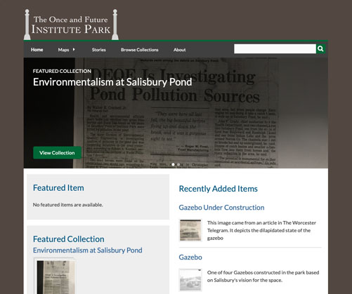

# The Once and Future Institute Park
This is an Omeka theme based on [Omeka's Berlin Theme](https://github.com/omeka/theme-berlin), customized for the digital history project __[The Once and Future Insititute Park](hu3900-institutepark.org)__.

## What this theme is all about
The goal of this theme was to primarily make the Berlin theme in Omeka Classic look better (and more specifically, fit the theme of the site we built it for). We also addressed a few other issues, such as being able to add sponsor logos to the footer of the site, making the homepage more useful, and crafting the theme for viewing on phone screens. The theme uses no custom plugins, so it should be drop-in compatible with most Omeka sites. 

## Building this theme:
This theme is built with Sass CSS, and as such needs to be compiled before it can be used. To do this, we use webpack.
1) Install node.js and webpack (cli)
2) run `npm install`
3) To compile the css and js, run `webpack`

## Using this theme:
After you build the theme, just upload it into your Omeka Classic themes folder, and you should be able to select it from your Omeka admin page.

This theme has a lot of configuration options. Make sure to check them out under appearance settings to get the most out of the theme. If you want to configure more advanced things (like the color scheme), then you might have to make code modifications. Take a look at the above "Building" section to learn how to make changes appear on the site.

## Need Help?
If there is something wrong with the theme, you can create a GitHub issue.